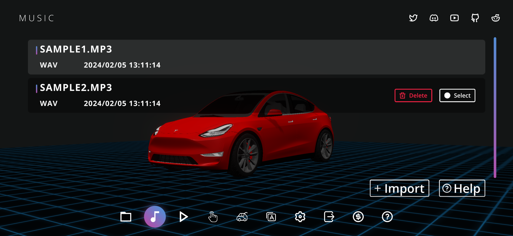
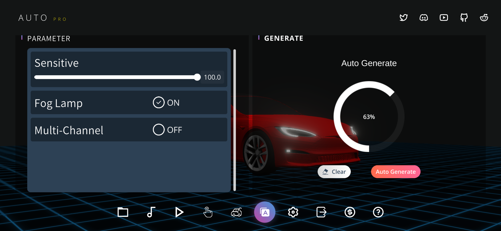
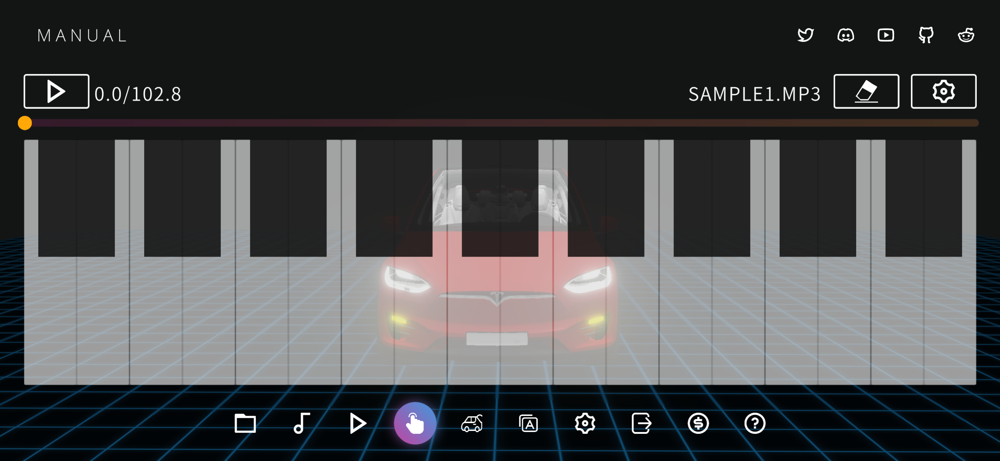

# Light Show Creator 使用文档
自定义灯光秀是特斯拉汽车的一项很酷的功能。 LightShowCreator是一款可以快速轻松制作灯光秀的APP。 如果你对它感兴趣，你也可以尝试用它来定制你自己的节目。
+ [AppStore](https://apps.apple.com/us/app/light-show-creator/id6446385602)
+ [Google Play](https://play.google.com/store/apps/details?id=com.coding1024.tslshow)
+ [Microsoft Store](https://www.microsoft.com/store/productId/9PL28B7M856D)

# U盘要求
+ 必须包含一个名为“LightShow”的基本文件夹（解压从该项目下载的 LightShow.zip）
+ 必须格式化为 exFAT、FAT 32（适用于 Windows）、MS-DOS FAT（适用于 Mac）、ext3 或 ext4。 当前不支持 NTFS。
+ 根目录不得包含的 TeslaCam 文件夹。

特斯拉官方指南: https://github.com/teslamotors/light-show

# 如何创建新项目
打开“项目”页面，点击“新建项目”按钮，输入项目名称

# 如何导入音乐
## Android
如果您的系统是Android，您可直接从文件系统里选择一首不超于5分钟的mp3或者wav文件来导入。

## IOS
如果您的系统是IOS，您需要从第三方APP里导入音乐，如ICloud, OneDrive, GoogleDrive, Dropbox。任意支持文件共享的APP都可以，以下OneDrive为例：

在OneDrive里选择音乐文件

点击"使用其它应用打开"

选择Light Show Creator，如果这个列表里没有，则点击"更多"，在里面能找到Light Show Creator

上一步点击分享之后，系统会切到Light Show Creator，点击“音乐”页面，您选择的音乐在几秒钟内会出现在这个列表。

点击您要使用的音乐，到此，导入音乐完成啦

# 自动模式如何使用

自动模式的使用非常简单，只需要点亮“自动”按钮，车灯就会根据音乐的节奏自动亮起。点击播放按钮开始录制灯光秀，直到音乐播放结束，灯光秀就制作完成啦。

在录制的过程中，您可以调节一些参数：
+ 步进时间：就是每帧的时长， 越大越省内存
+ 节奏敏感度：对音乐节奏的敏感度，理论上越小越省内存
+ 节拍时长：每次车灯亮起的最大时长，越大越省内存
+ 雾灯开关（标续的Model 3和Model Y是没有前雾灯的，把这个选项关掉效果更加）

# 手动模式如何使用
手动模式可以进行更加个性化的编辑，就像是弹钢琴一样，非常简单。两个对称的车灯作为一组，黑键是同时亮起，白键是音边亮起。

在手动录制的同时，也可以激活自动模式，只需要自己控制关键的几个车灯即可。

# 如何导出灯光秀文件
导出灯光秀与导入音乐的原理一样，也是通过分享功能向第三方app发送，下面还是以OneDrive为例:

# 如何使用xLights进行更加精细的编辑
目前我们的APP还不支持渐变效果和门窗的控制，如果您有这方面的需求，您可以把lightshow.wav/mp3，lightshow.fseq，lightshow.xsq，三个文件放到PC设备的同一个目录，然后用xLights打开即可。

# Q&A
### 手动模式下，如果音乐的节奏太快，跟不上节拍怎么办
您可以在设置页面，设置音乐的播放速度

### 为什么Window版本不支持手动模式
近期windows还没有更新计划，因为windows不支持触屏，与手机版本差异比较大。

### 有什么好办法做多车联动表演
我们后续的版本计划里有规划这项功能，目前有个建议，您可以把您的音乐切分成多个音轨，然后新建多个项目，使用自动模式的功能，这样可以快速的制作多辆车的灯光秀

# 这里分享一些LightShowCreator制作的demo

### Scenes
|Songs|Preview|Download|
|---|---|---|
|Halloween Kills(Main Title Theme)|[Youtube](https://youtu.be/EEkjOqiCXso)|[LightShow.zip](Scenes/HalloweenKills/LightShow.zip)|
|Thriller - Michael Jackson|[Youtube](https://youtu.be/DHbQ05eTug8)|[LightShow.zip](Scenes/Thriller/LightShow.zip)|
|Wedding March (The bride debut)|[Youtube](https://youtu.be/iakQSEtRHS8)|[LightShow.zip](Scenes/Wedding1/LightShow.zip)|
|Wedding March (The bride leaves)|[Youtube](https://youtu.be/Gn86WnPEw6o)|[LightShow.zip](Scenes/Wedding2/LightShow.zip)|
|Happy Birthday|[Youtube](https://youtu.be/c4l5BWJmnm8)|[LightShow.zip](Scenes/HappyBirthday/LightShow.zip)|
|Merry Christmas|[Youtube](https://youtu.be/pC14N6Z2QZY)|[LightShow.zip](Scenes/MerryChristmas/LightShow.zip)|

### Funny & BGM
|Songs|Preview|Download|
|---|---|---|
|Auf Und Auf Voll Lebenslust|[Youtube](https://youtu.be/QG7xRLSWCg0)|[LightShow.zip](Funny&BGM/AufUndAufVollLebenslust/LightShow.zip)|
|AxelF|[Youtube](https://youtu.be/2tdLb02Y96o)|[LightShow.zip](Funny&BGM/AxelF/LightShow.zip)|
|BettyBoop|[Youtube](https://youtu.be/H2x7Mawssjo)|[LightShow.zip](Funny&BGM/BettyBoop/LightShow.zip)|
|JingleBell(LaughingAllTheWay)|[Youtube](https://youtu.be/J-K50W4beiU)|[LightShow.zip](Funny&BGM/JingleBell(LaughingAllTheWay)/LightShow.zip)|
|KillBill|[Youtube](https://youtu.be/6oPdOL5JQ6g)|[LightShow.zip](Funny&BGM/KillBill/LightShow.zip)|
|Nijamena|[Youtube](https://youtu.be/3vFTLrvxN0A)|[LightShow.zip](Funny&BGM/Nijamena/LightShow.zip)|
|Seafights|[Youtube](https://youtu.be/5yDf8Ge_mEE)|[LightShow.zip](Funny&BGM/Seafights/LightShow.zip)|
|The Hampster Dance Song|[Youtube](https://youtu.be/Nl9QJFfxf2Y)|[LightShow.zip](Funny&BGM/TheHampsterDanceSong/LightShow.zip)|
|Victory - Two Step From Hell | [Youtube](https://youtu.be/JfHDj0td7Y8)|[LightShow.zip](Funny&BGM/Vectory/LightShow.zip)

### Popular
|Songs|Preview|Download|
|---|---|---|
|Tuesday|[Youtube](https://youtu.be/dwjc0wLnCfQ)|[LightShow.zip](Popular/Tuesday/LightShow.zip)|
|DEAJ VU|[Youtube](https://youtu.be/dvio49U2RhE)|[LightShow.zip](Popular/DEJA%20VU/LightShow.zip)
|Pump It Up|[Youtube](https://youtu.be/G-VYmN47iyo)|[LightShow.zip](Popular/PumpItUp/LightShow.zip)

### For Kids
|Songs|Preview|Download|
|---|---|---|
|Schnappi|[Youtube](https://youtu.be/b-RGHncYe1Q)|[LightShow.zip](ForKids/Schnappi/LightShow.zip)|

### World Cup
|Songs|Preview|Download|
|---|---|---|
|Hayya Hayya (2022)|[Youtube](https://youtu.be/RpJeS3fIH1s)|[LightShow.zip](WorldCup/HayyaHayya/LightShow.zip)|
|The Cup of Life (1998)|[Youtube](https://youtu.be/cqOPomTxMpo)|[LightShow.zip](WorldCup/TheCupOfLife/LightShow.zip)|
|We Will Rock You (1994)|[Youtube](https://youtu.be/zCorVvQh99k)|[LightShow.zip](WorldCup/WeWillRockYou/LightShow.zip)|
