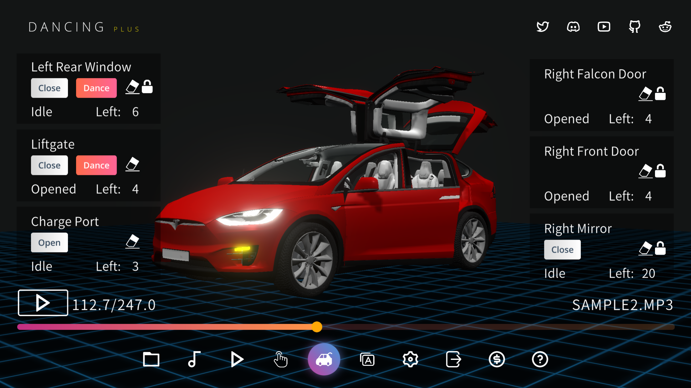
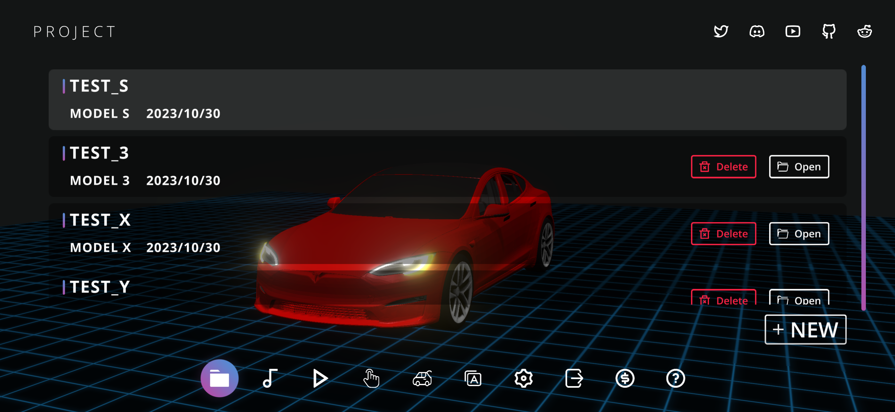
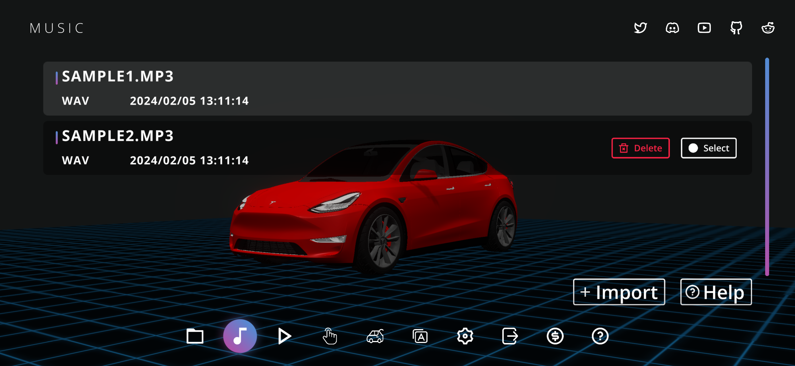
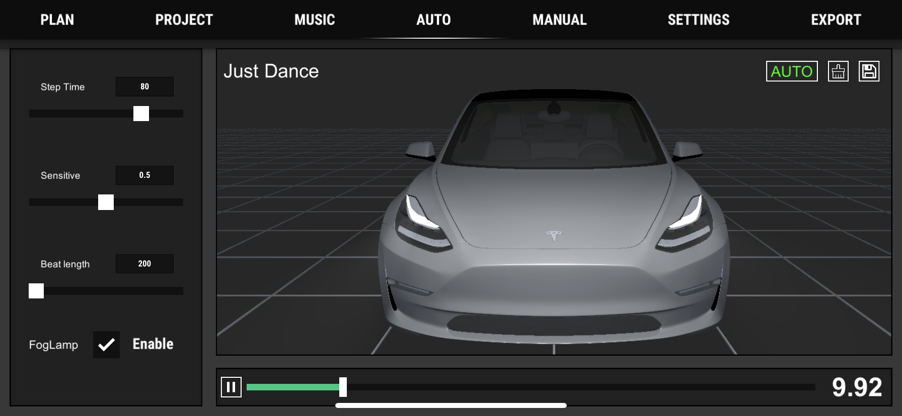
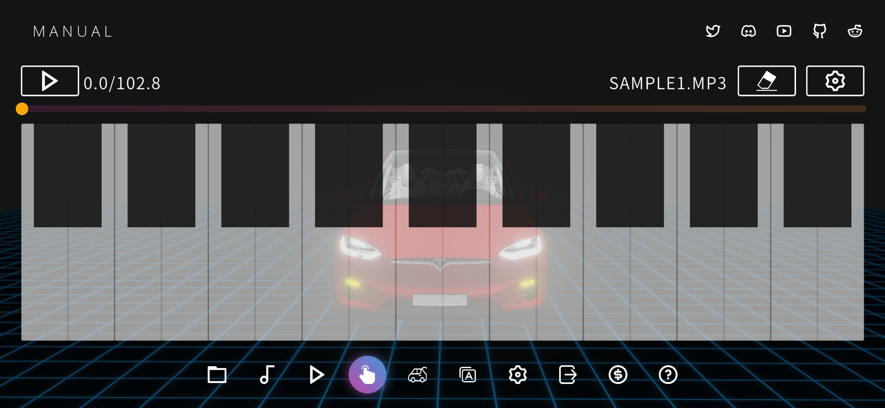
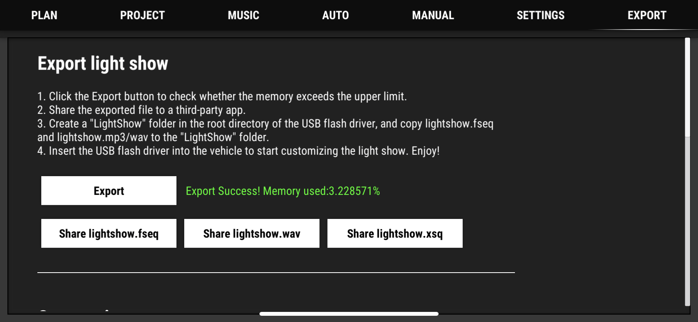

<h1 align="center"/>Light Show Creator Guide</h1>

	<a href="./README.md">English</a>
	/
    <a href="./README-zh.md">简体中文</a>

Custom light show is a cool feature of Tesla vehicles. LightShowCreator is an APP that can make light show quickly and easily.If you are interested in it, you can also try to use it to customize your own show.
+ [AppStore](https://apps.apple.com/us/app/light-show-creator/id6446385602)
+ [Google Play](https://play.google.com/store/apps/details?id=com.coding1024.tslshow)
+ [Microsoft Store](https://www.microsoft.com/store/productId/9PL28B7M856D)

# USB flash drive requirements
+ Must contain a base-level folder called "LightShow"(Unzip LightShow.zip downloaded from this project)
+ Must be formatted as exFAT, FAT 32 (for Windows), MS-DOS FAT (for Mac), ext3, or ext4. NTFS is currently not supported.
+ Must not contain a base-level TeslaCam folder.

Tesla Offical guides: https://github.com/teslamotors/light-show

# Create a New Project
Open the "Project" page, click the "New" button, enter the name of the project

# How to import music

# How to use automatic mode

The use of the automatic mode is very simple, you only need to light up the "auto" button, and the lights will automatically light up according to the rhythm of the music. Click the play button to start recording the light show, until the end of the music playback, the light show is completed.

During recording, you can adjust some parameters:
+ Step time: It is the duration of each frame, the bigger the more memory is saved
+ Sensitive: the sensitivity to music rhythm, theoretically, the smaller the memory, the less
+ Fog light switch (the standard continued Model 3 and Model Y do not have front fog lights, it will be more effective to turn off this option)

# How to use manual mode
Manual mode allows for more personalized editing, just like playing the piano, very simple. Two symmetrical car lights are used as a group, the black keys are lit at the same time, and the white keys are lit at the sound side.

# How to export light show files
The principle of exporting a light show is the same as importing music, and it is also sent to a third-party app through the sharing function. Let's take OneDrive as an example:

# Q&A
### In manual mode, what should I do if the rhythm of the music is too fast to keep up with the beat?
You can set the music playback speed on the settings page

### Why does the Windows version not support manual mode
There is no update plan for windows in the near future, because windows does not support touch screen, which is quite different from the mobile version.

### Is there any good way to do multi-car linkage performance
We have planned this function in our subsequent version plan. At present, there is a suggestion that you can divide your music into multiple tracks, then create multiple projects, and use the function of automatic mode, so that you can quickly create multiple cars. light show

# Here we share some demos created by LightShowCreator. 
### Scenes
|Songs|Preview|Download|
|---|---|---|
|Halloween Kills(Main Title Theme)|[Youtube](https://youtu.be/EEkjOqiCXso)|[fseq](Downloads/HalloweenKills.fseq) [mp3](Downloads/HalloweenKills.mp3) [xsq](Downloads/HalloweenKills.xsq)|
|Thriller - Michael Jackson|[Youtube](https://youtu.be/DHbQ05eTug8)|[fseq](Downloads/Thriller.fseq) [mp3](Downloads/Thriller.mp3) [xsq](Downloads/Thriller.xsq)|
|Wedding March (The bride debut)|[Youtube](https://youtu.be/iakQSEtRHS8)|[fseq](Downloads/Wedding1.fseq) [mp3](Downloads/Wedding1.mp3) [xsq](Downloads/Wedding1.xsq)|
|Wedding March (The bride leaves)|[Youtube](https://youtu.be/Gn86WnPEw6o)|[fseq](Downloads/Wedding2.fseq) [mp3](Downloads/Wedding2.mp3) [xsq](Downloads/Wedding2.xsq)|
|Happy Birthday|[Youtube](https://youtu.be/c4l5BWJmnm8)|[fseq](Downloads/HappyBirthday.fseq) [mp3](Downloads/HappyBirthday.mp3) [xsq](Downloads/HappyBirthday.xsq)|
|Merry Christmas|[Youtube](https://youtu.be/pC14N6Z2QZY)|[fseq](Downloads/MerryChristmas.fseq) [mp3](Downloads/MerryChristmas.mp3) [xsq](Downloads/MerryChristmas.xsq)|

### Funny & BGM
|Songs|Preview|Download|
|---|---|---|
|Auf Und Auf Voll Lebenslust|[Youtube](https://youtu.be/QG7xRLSWCg0)|[fseq](Downloads/AufUndAufVollLebenslust.fseq) [mp3](Downloads/AufUndAufVollLebenslust.mp3) [xsq](Downloads/AufUndAufVollLebenslust.xsq)|
|AxelF|[Youtube](https://youtu.be/2tdLb02Y96o)|[fseq](Downloads/AxelF.fseq) [mp3](Downloads/AxelF.mp3) [xsq](Downloads/AxelF.xsq)|
|BettyBoop|[Youtube](https://youtu.be/H2x7Mawssjo)|[fseq](Downloads/BettyBoop.fseq) [mp3](Downloads/BettyBoop.mp3) [xsq](Downloads/BettyBoop.xsq)|
|JingleBell(LaughingAllTheWay)|[Youtube](https://youtu.be/J-K50W4beiU)|[fseq](Downloads/JingleBell(LaughingAllTheWay).fseq) [mp3](Downloads/JingleBell(LaughingAllTheWay).mp3) [xsq](Downloads/JingleBell(LaughingAllTheWay).xsq)|
|KillBill|[Youtube](https://youtu.be/6oPdOL5JQ6g)|[fseq](Downloads/KillBill.fseq) [mp3](Downloads/KillBill.mp3) [xsq](Downloads/KillBill.xsq)|
|Nijamena|[Youtube](https://youtu.be/3vFTLrvxN0A)|[fseq](Downloads/Nijamena.fseq) [mp3](Downloads/Nijamena.mp3) [xsq](Downloads/Nijamena.xsq)|
|Seafights|[Youtube](https://youtu.be/5yDf8Ge_mEE)|[fseq](Downloads/Seafights.fseq) [mp3](Downloads/Seafights.mp3) [xsq](Downloads/Seafights.xsq)|
|The Hampster Dance Song|[Youtube](https://youtu.be/Nl9QJFfxf2Y)|[fseq](Downloads/TheHampsterDanceSong.fseq) [mp3](Downloads/TheHampsterDanceSong.mp3) [xsq](Downloads/TheHampsterDanceSong.xsq)|
|Victory - Two Step From Hell | [Youtube](https://youtu.be/JfHDj0td7Y8)|[fseq](Downloads/Vectory.fseq) [mp3](Downloads/Vectory.mp3) [xsq](Downloads/Vectory.xsq)|
|Chinese Suona (耍猴儿) | [Youtube](https://youtu.be/PHS2iNy9a-Y)|[fseq](Downloads/MonkeySuona.fseq) [mp3](Downloads/MonkeySuona.mp3) [xsq](Downloads/MonkeySuona.xsq)|

### Popular
|Songs|Preview|Download|
|---|---|---|
|Tuesday|[Youtube](https://youtu.be/dwjc0wLnCfQ)|[fseq](Downloads/Tuesday.fseq) [mp3](Downloads/Tuesday.mp3) [xsq](Downloads/Tuesday.xsq)|
|DEAJ VU|[Youtube](https://youtu.be/dvio49U2RhE)|[fseq](Downloads/DEJAVU.fseq) [mp3](Downloads/DEJAVU.mp3) [xsq](Downloads/DEJAVU.xsq)|
|Pump It Up|[Youtube](https://youtu.be/G-VYmN47iyo)|[fseq](Downloads/PumpItUp.fseq) [mp3](Downloads/PumpItUp.mp3) [xsq](Downloads/PumpItUp.xsq)|
|Ankaranin baglari|[Youtube](https://youtu.be/8BakNXETqkA)|[fseq](Downloads/ANKARANIN.fseq) [mp3](Downloads/ANKARANIN.mp3) [xsq](Downloads/ANKARANIN.xsq)|

### For Kids
|Songs|Preview|Download|
|---|---|---|
|Schnappi|[Youtube](https://youtu.be/b-RGHncYe1Q)|[fseq](Downloads/Schnappi.fseq) [mp3](Downloads/Schnappi.mp3) [xsq](Downloads/Schnappi.xsq)|

### World Cup
|Songs|Preview|Download|
|---|---|---|
|Hayya Hayya (2022)|[Youtube](https://youtu.be/RpJeS3fIH1s)|[fseq](Downloads/HayyaHayya.fseq) [mp3](Downloads/HayyaHayya.mp3) [xsq](Downloads/HayyaHayya.xsq)|
|The Cup of Life (1998)|[Youtube](https://youtu.be/cqOPomTxMpo)|[fseq](Downloads/TheCupOfLife.fseq) [mp3](Downloads/TheCupOfLife.mp3) [xsq](Downloads/TheCupOfLife.xsq)|
|We Will Rock You (1994)|[Youtube](https://youtu.be/zCorVvQh99k)|[fseq](Downloads/WeWillRockYou.fseq) [mp3](Downloads/WeWillRockYou.mp3) [xsq](Downloads/WeWillRockYou.xsq)|
